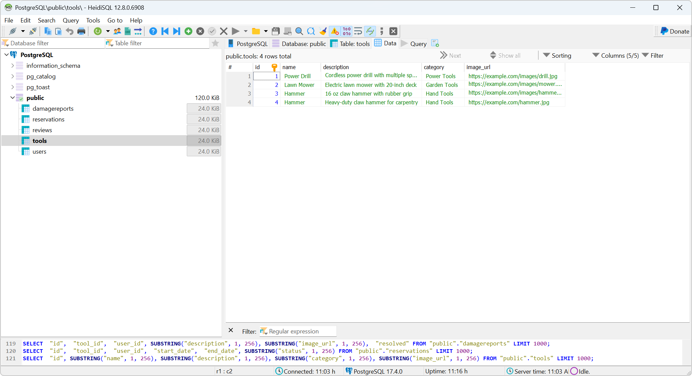

# Setting up of DB(PostgreSQL)
- Install PostgreSQL from https://www.postgresql.org/download/windows/
- Install HeidiSQL for managing the DB https://www.heidisql.com/download.php
- Import DB/database.sql in HeidiSQL to create the tool_library_db database

# Setting up of Backend APIs
- Implemented below set of APIs
  - Auth Controller
    - /api/auth/login
    - /api/auth/signup
  - Tool Controller
    - /api/tools
    - /api/tools
    - /api/tools/1
  - Reservation Controller
    - /api/reservations
    - /api/reservations/my
    - /api/reservations/user/2
  - Review Controller
    - /api/reviews
    - /api/reviews/1
  - Damage Report Controller
    - /api/reports
    - /api/reports/1

## How to run the backend?
- .env file has the DB connection details and database(tool_library_db) to connect
- The below command will run the backend at 5000 port
  - npm run dev

